# 📊 생성 이미지 종합 평가 리포트

| 미리보기 | 파일명 | PSNR (dB) | SSIM | FID 영향도 |
|:---:|---|:---:|:---:|:---:|
| 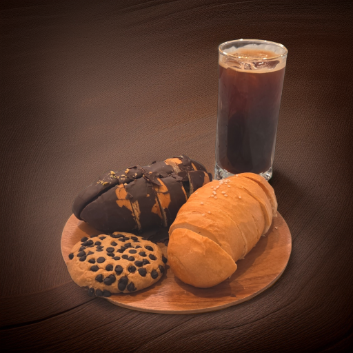 | `bakery_product1_20260703091903.07.png` | 29.73 | 0.5120 | -0.5153 |
| 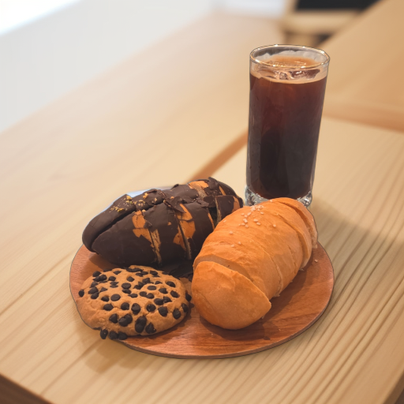 | `bakery_product1_20260706004603.23.png` | 29.55 | 0.8191 | +0.0678 |
| 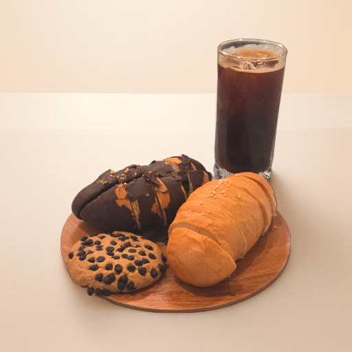 | `bakery_product1_20260706013245.98.png` | 29.51 | 0.8747 | +0.0789 |
| 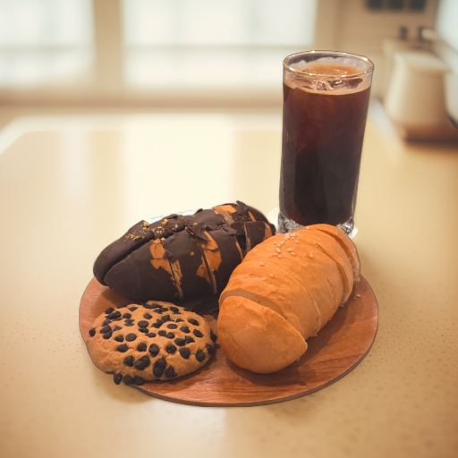 | `bakery_product1_20260706013830.62.png` | 29.47 | 0.8103 | +0.1092 |
| 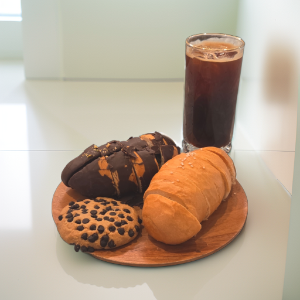 | `bakery_product1_20260706014204.10.png` | 29.56 | 0.8500 | +0.2120 |
|  | `bakery_product1_20260706022332.69.png` | 29.73 | 0.8524 | +0.0603 |
| 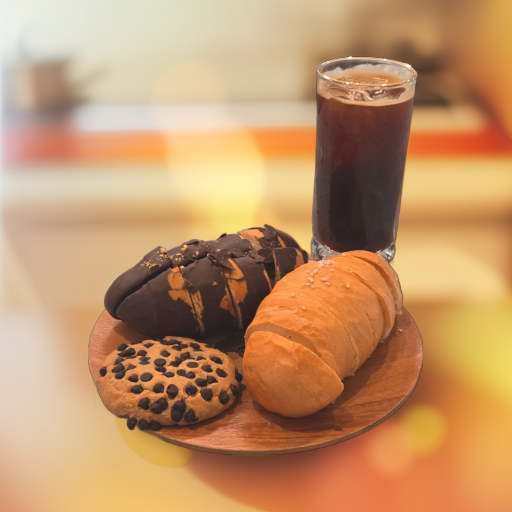 | `bakery_product1_20260706022710.63.png` | 29.55 | 0.7900 | -0.1081 |
| 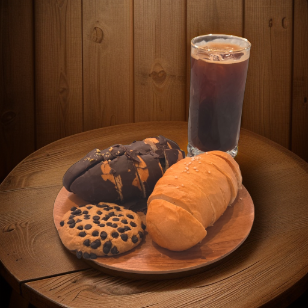 | `bakery_product1_20260706022959.44.png` | 29.38 | 0.5052 | -0.5935 |
| 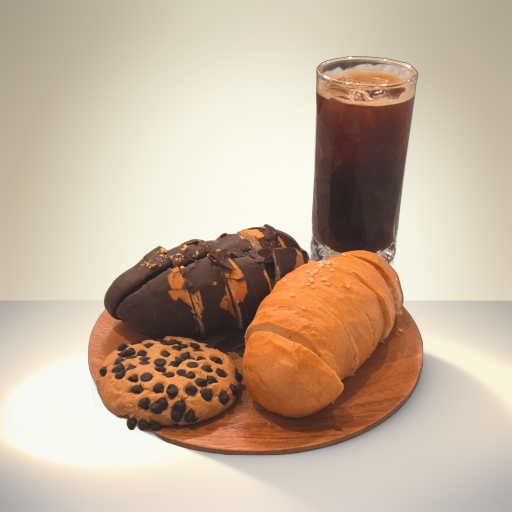 | `bakery_product1_20260706023308.54.png` | 29.26 | 0.8530 | +0.1397 |
| 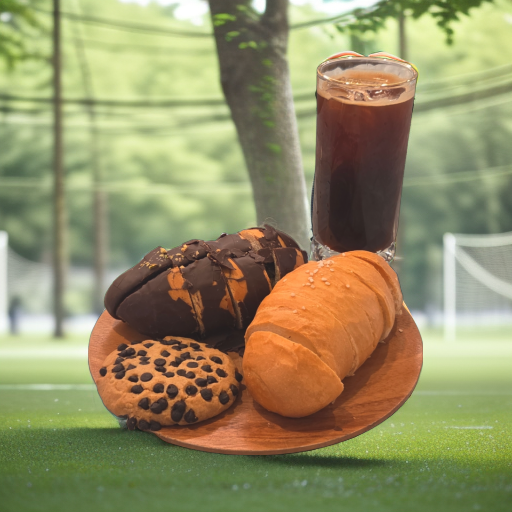 | `bakery_product1_20260706023621.53.png` | 29.36 | 0.6132 | -0.0979 |
| 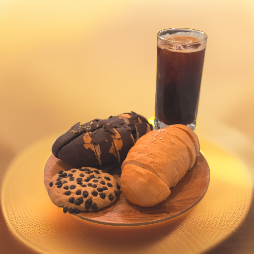 | `bakery_product1_20260706023916.73.png` | 29.60 | 0.8069 | -0.2404 |
| 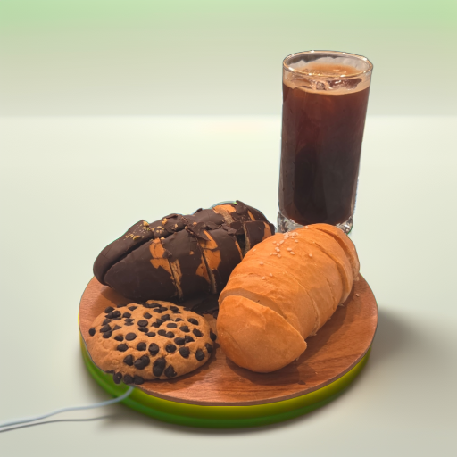 | `bakery_product1_20260706024842.26.png` | 29.52 | 0.8513 | +0.1606 |
| 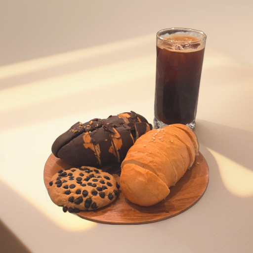 | `bakery_product1_20260706040629.79.png` | 29.44 | 0.8510 | +0.1031 |
| 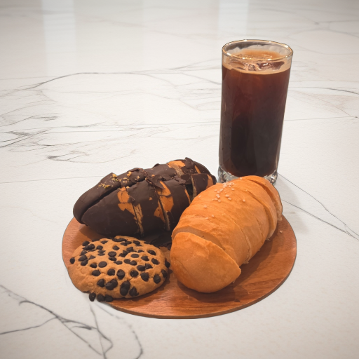 | `bakery_product1_20260706040929.78.png` | 29.66 | 0.8091 | +0.2309 |
| 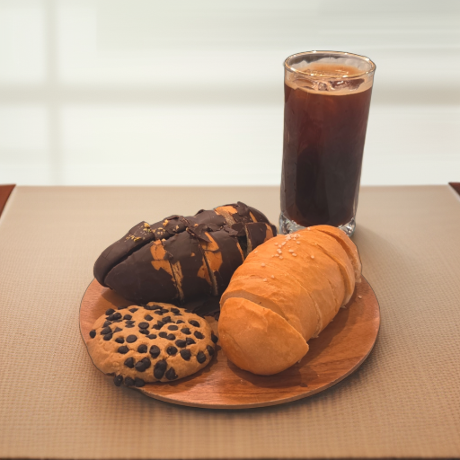 | `bakery_product1_20260706084020.23.png` | 29.80 | 0.8447 | +0.2193 |
| 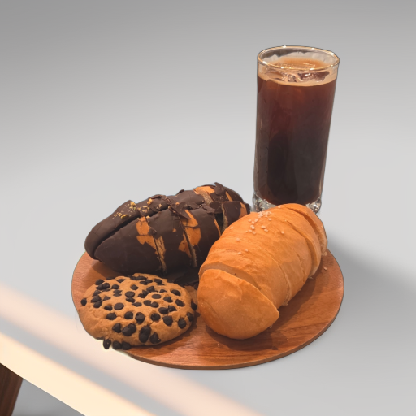 | `bakery_product1_20260706084607.93.png` | 29.38 | 0.8535 | +0.2047 |
| 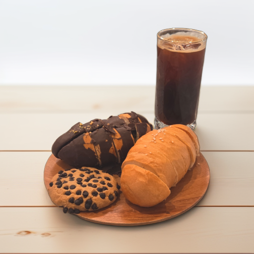 | `bakery_product1_20260706090624.01.png` | 29.68 | 0.8529 | +0.1612 |
